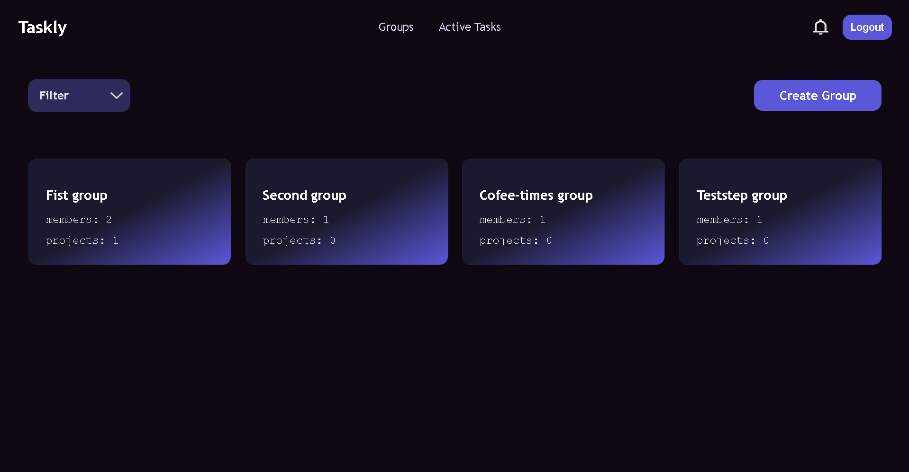
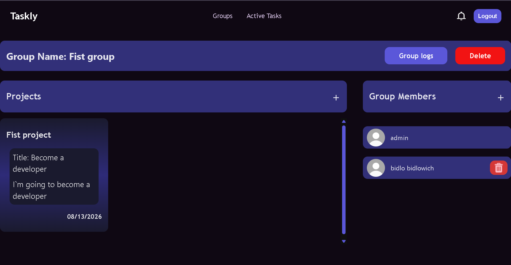
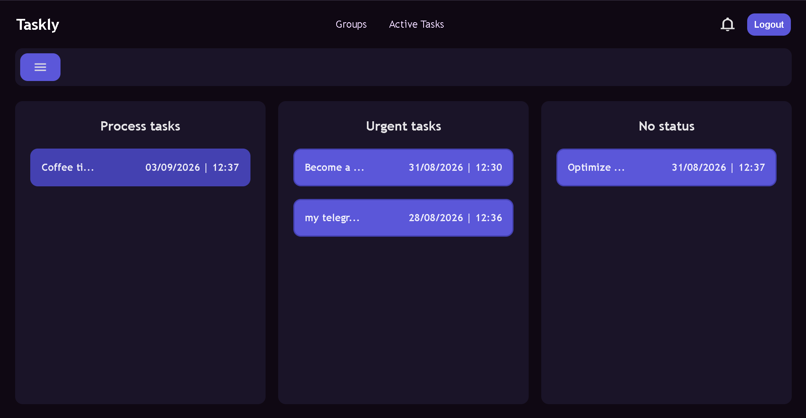
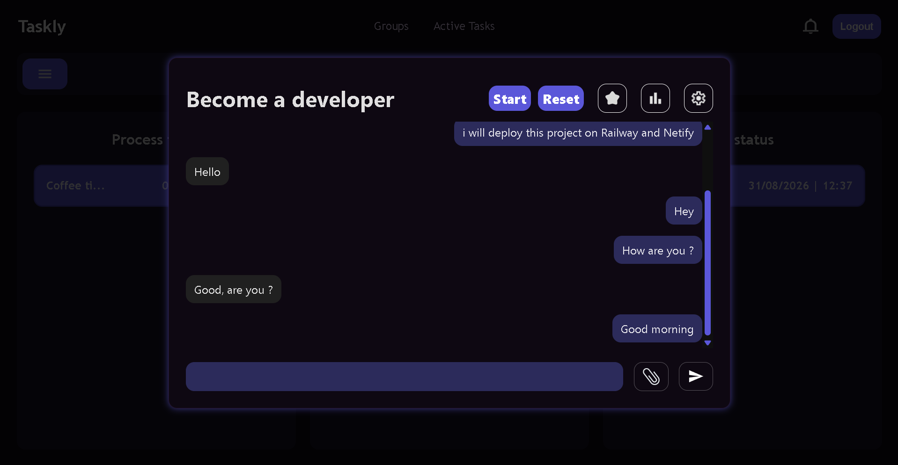
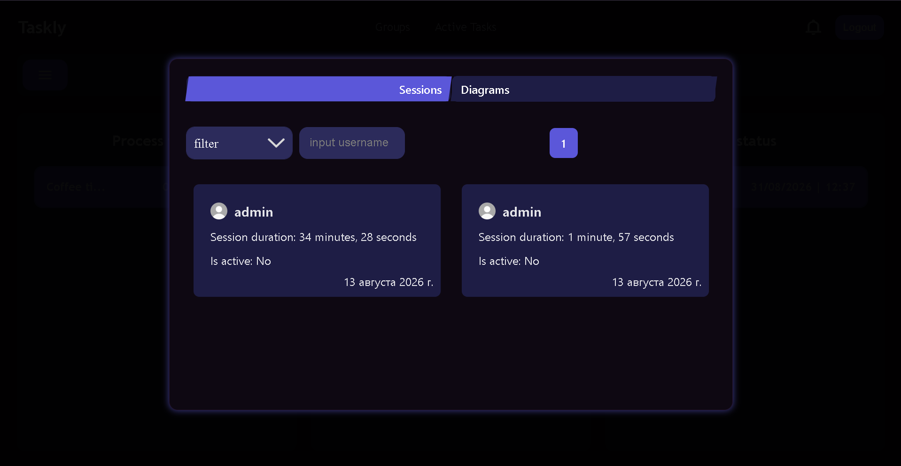
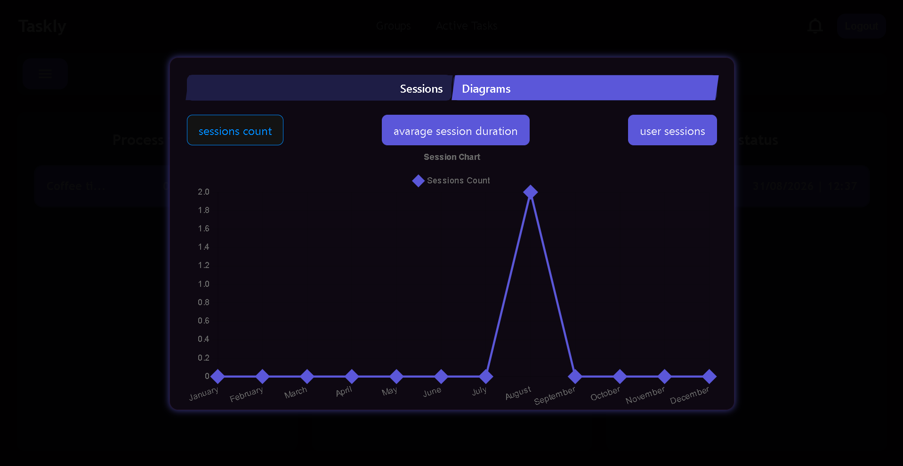
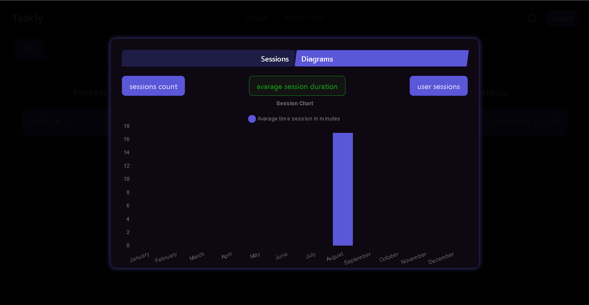
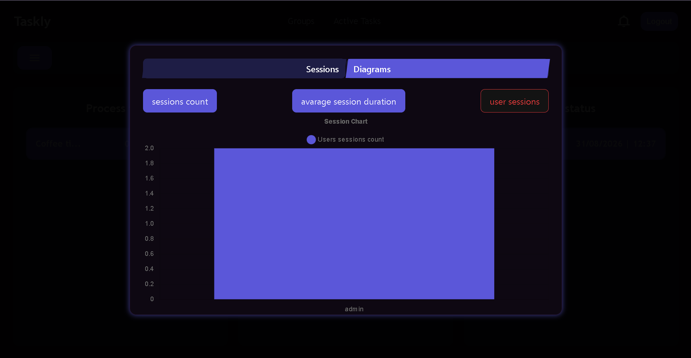

# Taskly
 
**Real-time task and team management platform with live notifications, session tracking, and built-in task discussions.**
 
[](https://www.python.org/)
[](https://www.django-rest-framework.org/)
[](https://react.dev/)
[](https://redis.io/)
[](https://www.docker.com/)
 
[Features](#features) • [Tech Stack](#tech-stack) • [Screenshots](#screenshots) • [Getting Started](#getting-started) • [Architecture](#architecture)
 
---
 
## Overview
 
Taskly is a group-based project management tool built for teams that need to organize work, track time, and communicate — all in one place. Managers can organize users into groups, spin up projects, assign tasks with deadlines, and see real-time statistics on how their team is spending time. Every task doubles as a lightweight chat, so discussion never gets separated from the work itself.
 
<!-- Optional: 1-2 sentence "why I built this" or "what problem it solves" can go here -->
 
## Features
 
### 👥 Group & Access Management
- Create user groups and invite members
- Group managers assign task-level access to specific users
- Role-based permissions between managers and regular members
### 📋 Projects & Tasks
- Create projects inside a group
- Add tasks with assignees and deadlines
- Per-task access control — managers grant visibility to specific group members
### 💬 Task Discussions
- Built-in chat scoped to each task
- Discuss approach, blockers, and suggestions without leaving the task
### ⏱️ Time Tracking
- Start/stop session timers directly on a task
- Manager-facing statistics: total sessions, average session duration, and per-user breakdowns
### 🔔 Real-Time Notifications
- WebSocket-based live notifications
- Notification events generated server-side via Celery + Redis, delivered instantly to connected clients
## Tech Stack
 
| Layer | Technology |
|---|---|
| **Backend** | Python, Django, Django REST Framework |
| **Real-time** | Django Channels, WebSockets |
| **Async tasks & queue** | Celery, Redis |
| **Frontend** | React, TypeScript, Vite |
| **Database** | PostgreSQL |
| **Infrastructure** | Docker, Docker Compose |
 
## Screenshots
 
<!-- Add screenshots here once ready. Replace each placeholder line with:

-->
 
**GroupPage**
 
<div align="center">
  
</div>
 
**Group management**
 
<div align="center">
  
</div>
 
**Tasks view**
 
<div align="center">
  
</div>
 
**Task discussion (chat)**
 
<div align="center">
  
</div>
 
**Manager statistics**
 
<div align="center">
  
</div>

---

<div align="center">
  
</div>

---

<div align="center">
  
</div>

---

<div align="center">
  
</div>
 
## Demo
 
<!-- Add a short screen recording / GIF / hosted demo link here -->
 
> 🎥 Demo video coming soon
 
## Getting Started
 
### Prerequisites
- Docker & Docker Compose
- Node.js 18+ (for local frontend dev outside Docker, optional)
### Setup
 
```bash
# Clone the repository
git clone https://github.com/<your-username>/taskly.git
cd taskly
 
# Copy environment variables
cp .env.example .env
 
# Build and run all services
docker compose up --build
```
 
The app will be available at `http://localhost:<port>` and the API at `http://localhost:<port>/api`.
 
## Architecture
 
```
┌─────────────┐      WebSocket       ┌──────────────────┐
│   React     │ ◄──────────────────► │  Django Channels  │
│  (Vite/TS)  │                      │                    │
└─────────────┘      REST (DRF)      └────────┬───────────┘
                                               │
                                    ┌──────────┼──────────┐
                                    │          │          │
                              ┌─────▼───┐ ┌────▼────┐ ┌───▼────┐
                              │PostgreSQL│ │  Celery │ │  Redis │
                              └──────────┘ └─────────┘ └────────┘
```
 
- **REST API** (DRF) handles CRUD for groups, projects, tasks, and sessions
- **Django Channels** manages WebSocket connections for live chat and notifications
- **Celery workers** process background jobs (notification generation, statistics)
- **Redis** acts as the Channels layer backend and Celery broker

 
---
 
Built by [Dmytro](https://github.com/<your-username>)
